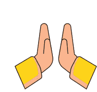

###  I'm Shreya Khantal

I am a **dedicated Full-Stack Developer**, continuously expanding my knowledge in **Artificial Intelligence**, **Data Science**, and **Web Development**. Currently, I am pursuing **BS** at **Indian Institute of Technology, Madras** and **B.Tech** at **Madhav Institute of Technology & Science**.

---

### 🛠️ Skills & Expertise

 

---

#### 📬 Connect with me: [LinkedIn](https://www.linkedin.com/in/shreyakhantal/) or [Email](mailto:khantalshreya@gmail.com)

---

### 🌈 "With every line of code and every problem solved my skills get evolved."
